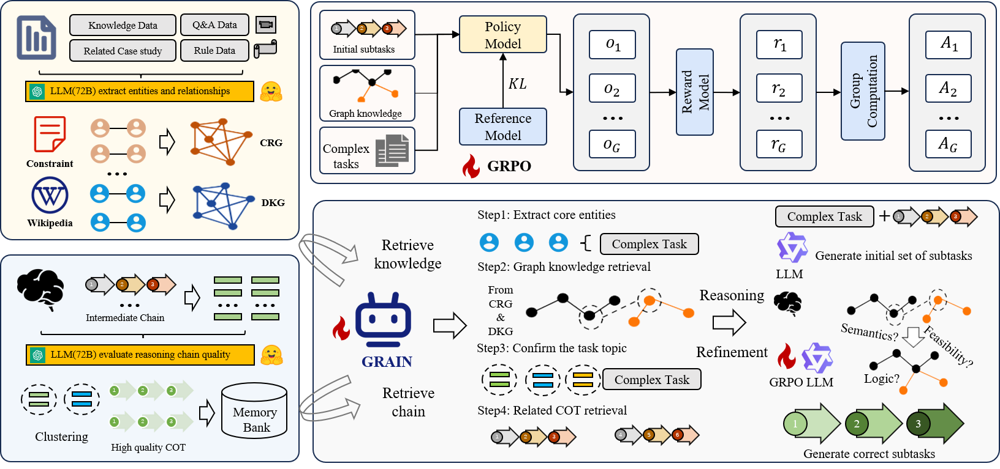
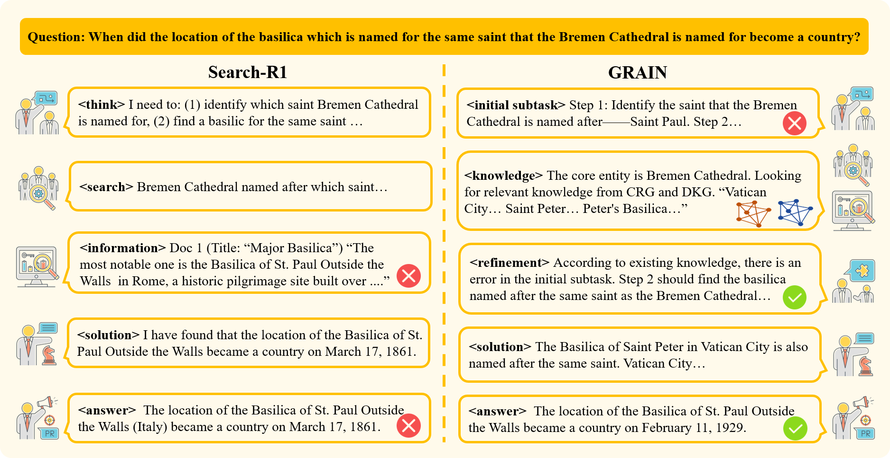
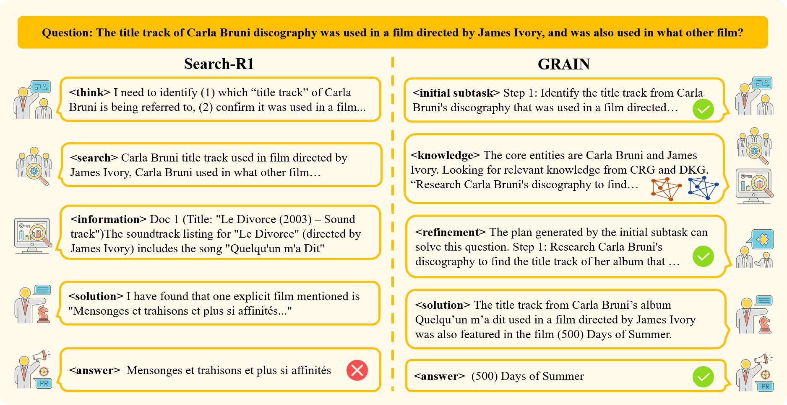

# GRAIN: Dual-Graph Augmentation with Structured Refinement for Mitigating Planning Hallucinations in Question Task Decomposition

## Abstract



Despite remarkable progress in complex reasoning, LLM-based agents still frequently suffer from planning hallucinations, producing illogical or non-executable subtask sequences in multi-hop tasks. This stems from their inability to explicitly model dependency constraints and structured relations of sub-tasks—limitations that conventional similarity-based retrieval fails to address.
To tackle these issues, we propose GRAIN: Graph-Augmented Refinement for Intelligent Decomposition, a novel graph-augmented framework for LLM agents. GRAIN introduces dual knowledge graphs—a Constraint Relations Graph that captures task dependencies and execution order, and a Domain Knowledge Graph that provides entity-level domain expertise. It refines initial LLM-generated subtasks by retrieving relevant subgraphs and performing structured correction of ordering, prerequisites, and domain consistency. We construct training tuples from initial subtask sets and knowledge-augmented contexts stored in a CoT memory bank, and fine-tune the agent with GRPO for more stable long-term reasoning.
We evaluate GRAIN on three challenging multi-hop QA benchmarks with Qwen2.5-3B, Llama3.2-3B, and Qwen2.5-7B backbones. Across all settings, GRAIN fine-tuned with GRPO consistently outperforms the compared baselines by a clear margin. In particular, it yields absolute gains of up to 10.0 points on the most compositional MuSiQue dataset and up to 16.5 points in average performance. These results indicate that GRAIN effectively mitigates planning hallucinations and improves the executability of multi-step plans, addressing key limitations in LLM reasoning and knowledge grounding.

## Environment Setup
```bash
conda create -n grain python=3.10
conda activate grain

pip install -r requirements.txt
```

## Project Structure
- `requirements.txt`: Pip environment file.
- `dataset/`: Evaluation datasets.
  - `2wikimultihopqa_corpus`: Corpus for the 2WikiMultiHopQA dataset.
  - `2wikimultihopqa.json`: Benchmark data for 2WikiMultiHopQA.
  - `hotpotqa_corpus.json`: Corpus for the HotpotQA dataset.
  - `hotpotqa.json`: Benchmark data for HotpotQA.
  - `musique_corpus.json`: Corpus for the MuSiQue dataset.
  - `musique.json`: Benchmark data for MuSiQue.
- `experiment.py`: Main script for running the experiments.
- `prompts.py`: Prompt library used in the experiments.
- `fewshots.py`: Few-shot demonstration examples for prompting.

## Get started
1. Configure the `.env` file by setting your LLM-related parameters, such as `base_url`, `api_key`, and other necessary fields. Please refer to the standard OpenAI API format for the configuration.

2. Create your own `CRG` and `DKG` JSON files as the required inputs for the experiments.

3. Run `experiment.py` to reproduce the results on the three datasets.

## Case Study




